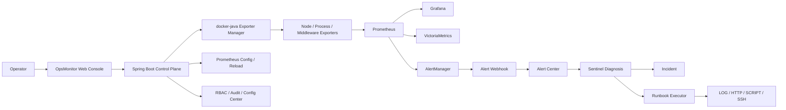

# OpsMonitor

[中文](README.md)

OpsMonitor is an automation-focused monitoring platform for servers and middleware. It combines a Spring Boot control plane, Prometheus metrics collection, Grafana visualization, AlertManager alerting, VictoriaMetrics long-term storage, and a Sentinel automation workflow. The goal is to provide monitoring, diagnosis, runbook execution, and incident management in one deployable system.

## What It Solves

Many monitoring setups split metrics, alerts, server inventory, diagnosis scripts, and incident records across different tools. When an outage happens, operators still need to log in to hosts manually, copy commands, check dashboards, and update incident states by hand. OpsMonitor brings those workflows into one platform:

- Register servers and exporters for Linux, Windows, and container-based targets.
- Maintain Prometheus targets, alert rules, and reload flow from the control plane.
- Receive AlertManager webhooks and manage alert acknowledgement, silence, and lifecycle.
- Trigger Sentinel diagnosis, create incidents, and execute runbook steps.
- Provide an operations console for overview, exporters, alerts, topology, notifications, config, tenants, audit, and users.

## Tech Stack, Real Pain Points, Quantified Results

| Tech Stack | Real Pain Point | Quantified Result |
| --- | --- | --- |
| Spring Boot 3.2 / Java 17 | Monitoring inventory, permissions, audit, config, and automation logic need one control plane | 20+ REST controllers covering servers, exporters, alerts, Sentinel, RBAC, tenants, and notifications |
| Prometheus / AlertManager / Grafana / VictoriaMetrics | Metrics, alert routing, dashboards, and long-term storage are usually configured separately | Docker Compose starts 5 monitoring components; default 15s scrape/evaluation; VictoriaMetrics keeps 365 days by default |
| docker-java 3.3.6 | Local containerized exporters are hard to manage manually | Supports exporter registration, start, stop, batch registration, health checks, and Prometheus target writing |
| Vue 3 CDN / static assets | Ops dashboards should be easy to ship with the backend without a frontend build pipeline | The Spring Boot app serves the admin console directly; `docs/` contains 7 product screenshots |
| Sentinel automation engine / JSch 0.2.17 | Alerts still require manual host login, diagnosis, and script execution | 14 Sentinel core classes; runbooks support LOG, HTTP, SCRIPT, and SSH steps |
| RBAC / audit / input validation | Operations platforms need permission boundaries and traceability for write actions | Built-in ADMIN / OPS / VIEWER role model and daily audit log persistence |

## Architecture



## Features

- Overview dashboard for agents, exporters, active alerts, and audit score.
- Exporter management with registration, batch registration, labels, health checks, and path diagnosis.
- Alert center with FIRING, ACKNOWLEDGED, and RESOLVED lifecycle states.
- Sentinel automation with manual diagnosis, alert-driven diagnosis, incident management, and runbook execution.
- Service topology organized by Global, Project, Service, and Instance.
- Notification channels for alert firing and recovery events.
- Config center with managed config versions and history.
- Multi-tenant model and RBAC for basic quota and permission management.
- System audit for configuration, health, alerts, managed resources, and platform status.

## Screenshots

Screenshots are stored in the `docs/` directory.


## Downloads and Deployment

### Download URLs

- JAR package: [ops-monitor.jar](https://github.com/kllin8154-arch/ops-monitor/releases/download/v1.0.0/ops-monitor.jar)
- Docker image: `ghcr.io/kllin8154-arch/ops-monitor:1.0.0`
- Docker latest: `ghcr.io/kllin8154-arch/ops-monitor:latest`

Default monitoring component images:

```text
prom/prometheus:latest
prom/alertmanager:latest
grafana/grafana:latest
prom/node-exporter:latest
victoriametrics/victoria-metrics:latest
```

### Online Deployment

For online environments, clone the repository, start the monitoring components, and run the JAR:

```powershell
git clone https://github.com/kllin8154-arch/ops-monitor.git
cd ops-monitor/app
docker compose -f docker/docker-compose.yml up -d
Invoke-WebRequest -Uri https://github.com/kllin8154-arch/ops-monitor/releases/download/v1.0.0/ops-monitor.jar -OutFile ops-monitor.jar
java -jar ops-monitor.jar
```

You can also run the control plane with the Docker image:

```powershell
docker pull ghcr.io/kllin8154-arch/ops-monitor:1.0.0
docker run -d --name ops-monitor `
  -p 8080:8080 `
  -e SERVER_ADDRESS=0.0.0.0 `
  -e OPS_ADMIN_PASSWORD=ChangeMe_Admin_123! `
  -e OPS_GRAFANA_PASSWORD=ChangeMe_Grafana_123! `
  -e OPS_HMAC_SECRET=replace-with-at-least-32-random-characters `
  -v ${PWD}/app/docker:/app/docker `
  -v ${PWD}/app/data:/app/data `
  ghcr.io/kllin8154-arch/ops-monitor:1.0.0
```

### Offline Deployment

For offline environments, prepare the JAR, repository config, and Docker image archive on an internet-connected machine:

```powershell
git clone https://github.com/kllin8154-arch/ops-monitor.git
Invoke-WebRequest -Uri https://github.com/kllin8154-arch/ops-monitor/releases/download/v1.0.0/ops-monitor.jar -OutFile ops-monitor.jar

docker pull ghcr.io/kllin8154-arch/ops-monitor:1.0.0
docker pull prom/prometheus:latest
docker pull prom/alertmanager:latest
docker pull grafana/grafana:latest
docker pull prom/node-exporter:latest
docker pull victoriametrics/victoria-metrics:latest

docker save -o ops-monitor-images.tar `
  ghcr.io/kllin8154-arch/ops-monitor:1.0.0 `
  prom/prometheus:latest `
  prom/alertmanager:latest `
  grafana/grafana:latest `
  prom/node-exporter:latest `
  victoriametrics/victoria-metrics:latest
```

Copy `ops-monitor.jar`, `ops-monitor-images.tar`, and the repository `app/docker/` directory to the offline server. Place the JAR at `ops-monitor/app/ops-monitor.jar`, then run:

```powershell
docker load -i ops-monitor-images.tar
cd ops-monitor/app
docker compose -f docker/docker-compose.yml up -d
java -jar ops-monitor.jar
```

If the offline environment also needs MySQL, Redis, Nginx, PostgreSQL, Windows Exporter, or other monitoring targets, pull the corresponding exporter images on the online machine and append them to the `docker save` command.

## Quick Start

### Requirements

- JDK 17+
- Maven 3.8+
- Docker Engine
- Docker Compose v2

### Configure Environment Variables

Copy the example file and adjust it as needed:

```powershell
Copy-Item .env.example .env
```

Development can use defaults. Production or internet-facing deployments must use strong passwords and random secrets:

```powershell
$env:OPS_ADMIN_PASSWORD="ChangeMe_Admin_123!"
$env:OPS_GRAFANA_PASSWORD="ChangeMe_Grafana_123!"
$env:OPS_HMAC_SECRET="replace-with-at-least-32-random-characters"
$env:OPS_WEBHOOK_SECRET="replace-with-random-webhook-secret"
```

### Start Monitoring Components

Run commands from the `app/` directory. The effective runtime config directory is `app/docker/`.

```powershell
cd app
docker compose -f docker/docker-compose.yml up -d
```

### Start OpsMonitor

```powershell
mvn spring-boot:run
```

Endpoints:

- OpsMonitor Admin: http://127.0.0.1:8080/admin
- Classic Console: http://127.0.0.1:8080/
- Prometheus: http://127.0.0.1:9090
- AlertManager: http://127.0.0.1:9093
- Grafana: http://127.0.0.1:3000
- VictoriaMetrics: http://127.0.0.1:8428

## Build and Verify

```powershell
cd app
mvn -q -DskipTests compile
```

## Repository Layout

```text
ops-monitor/
  app/
    pom.xml
    docker/                      # Effective Prometheus / Grafana / AlertManager config
    src/main/java/com/opsmonitor # Spring Boot backend source
    src/main/resources/static    # Vue 3 CDN admin console static assets
    src/main/resources/templates # Classic page templates
  docs/                          # Public screenshots
  README.md
  README.en.md
```

## Requirements and Contributions

Issues and pull requests are welcome, especially around enterprise monitoring, automated diagnosis, and operations workflows. Good contribution areas include:

- New exporter templates, such as PostgreSQL, MySQL, Redis, Nginx, Windows, JVM, or custom business metrics.
- Alert rules, recording rules, Grafana dashboards, and service topology improvements.
- Sentinel diagnosis rules, incident classification, runbook step types, and execution result views.
- RBAC, audit logs, input validation, deployment security, and production configuration experience.
- Documentation, installation scripts, sample configs, screenshots, and troubleshooting guides.

When opening an issue, please describe the scenario, target environment, expected behavior, and reproduction steps. When submitting a PR, keep the change focused and include build or manual verification notes.

## Security Notes

- Default passwords are for local development only. Production deployments must set `OPS_ADMIN_PASSWORD`, `OPS_GRAFANA_PASSWORD`, and `OPS_HMAC_SECRET`.
- Production deployments should set `OPS_WEBHOOK_SECRET` and align it with the AlertManager webhook config.
- SSH runbooks should use strict host key checking in production, with `OPS_SSH_KNOWN_HOSTS` configured.
- Do not commit `data/`, `app/data/`, `.env`, lock files, health reports, or audit logs.

## License

This repository does not include a license file yet. Before publishing, choose a license. Apache-2.0 or MIT are common choices for infrastructure projects.
