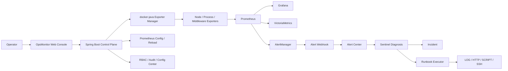
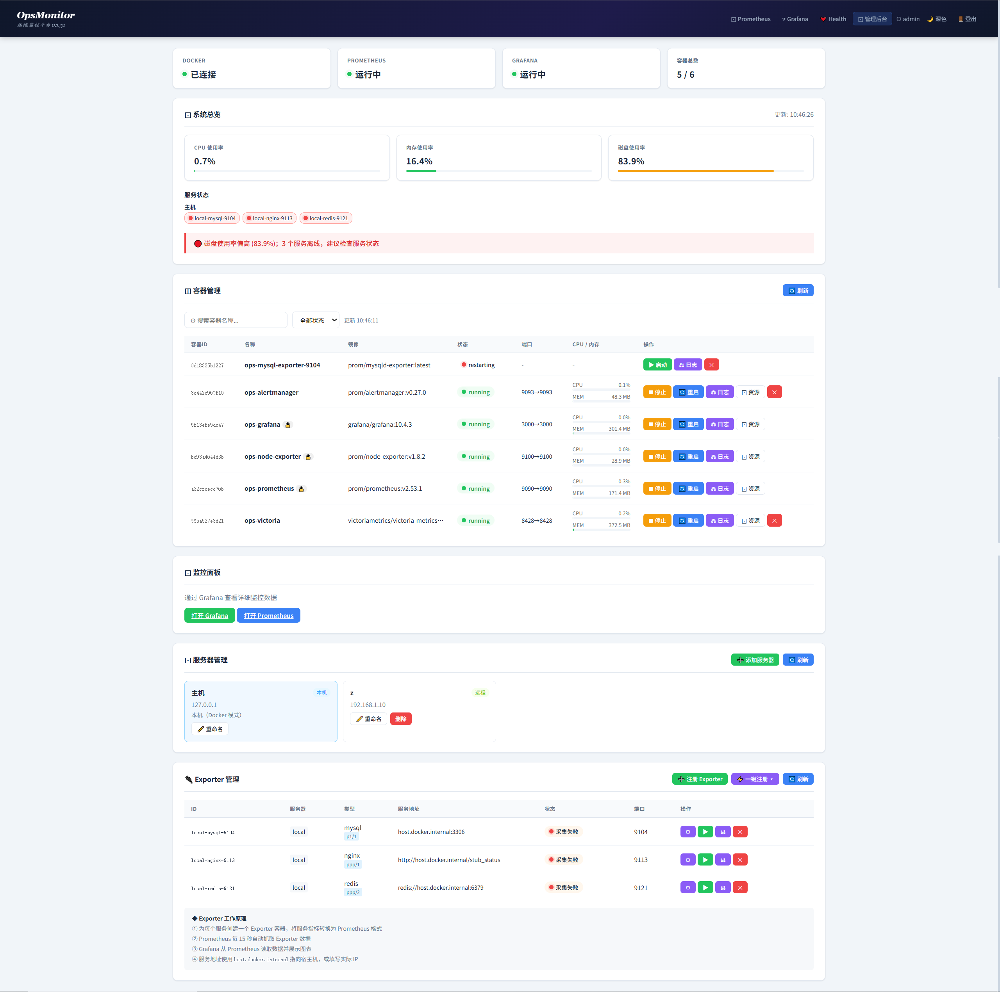
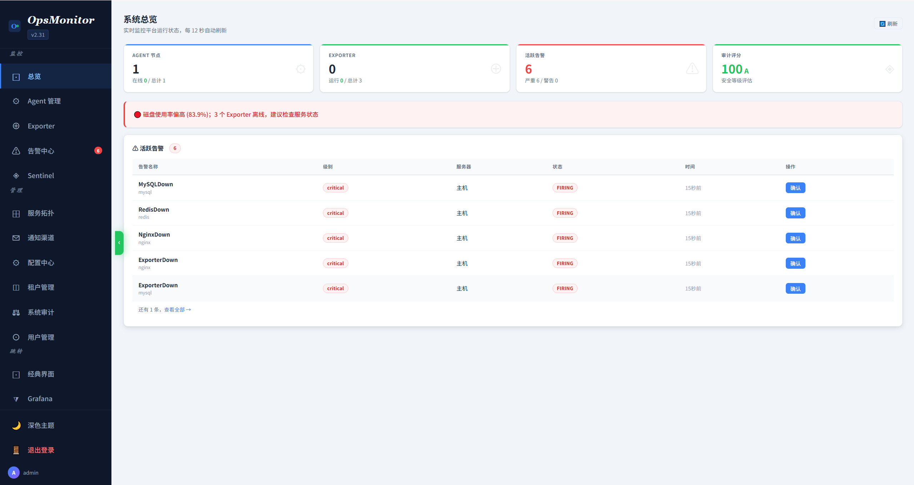
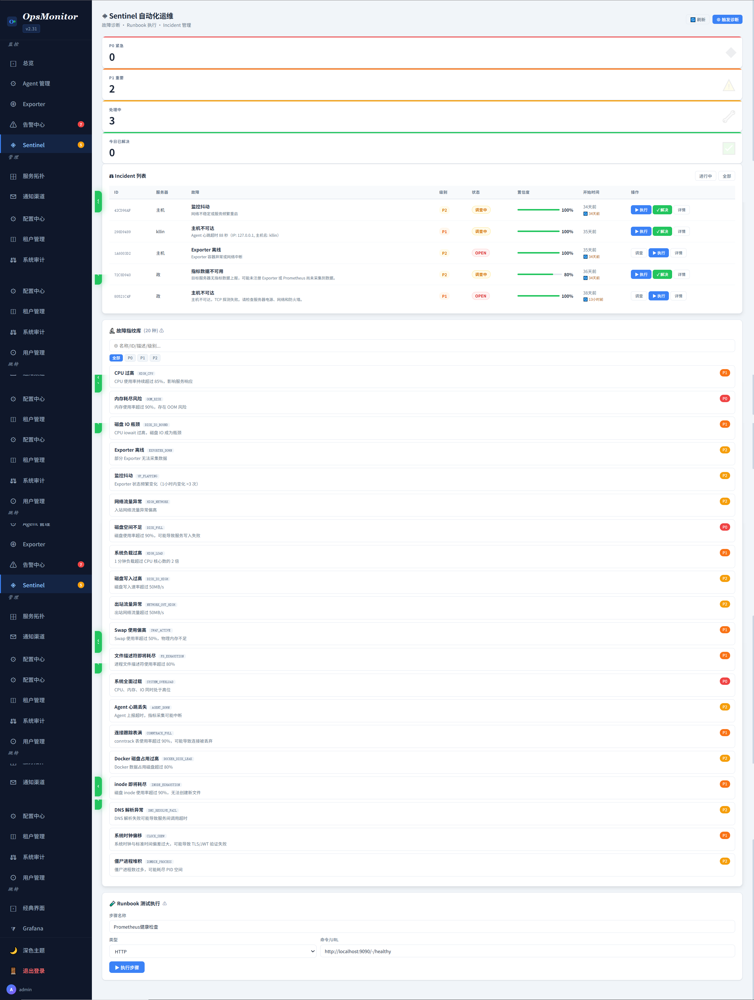
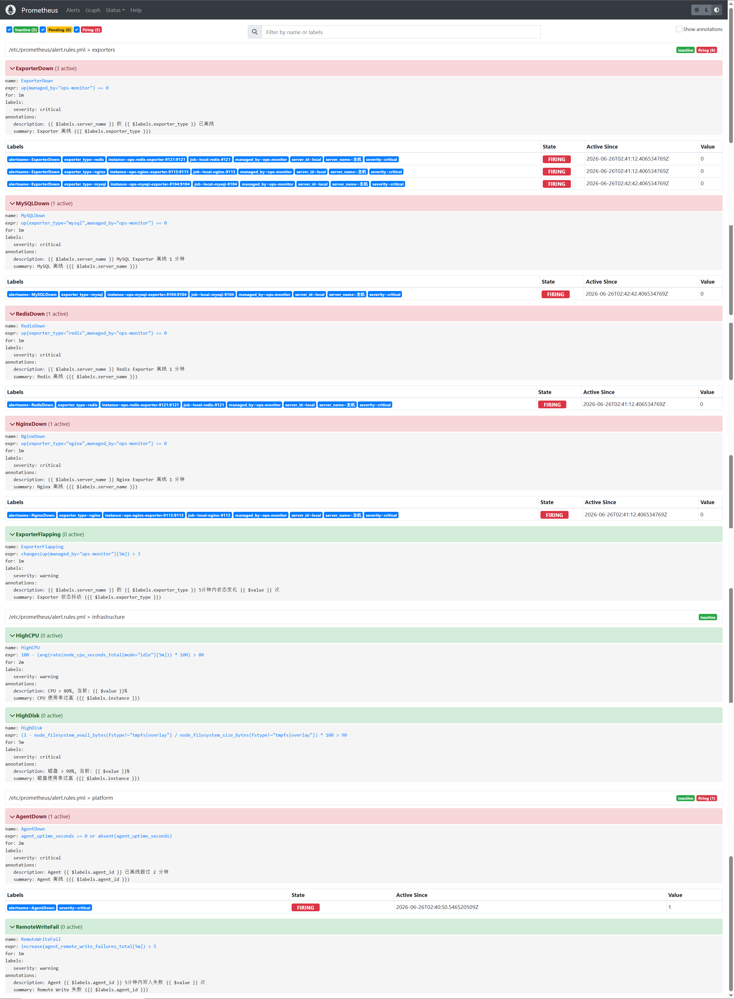
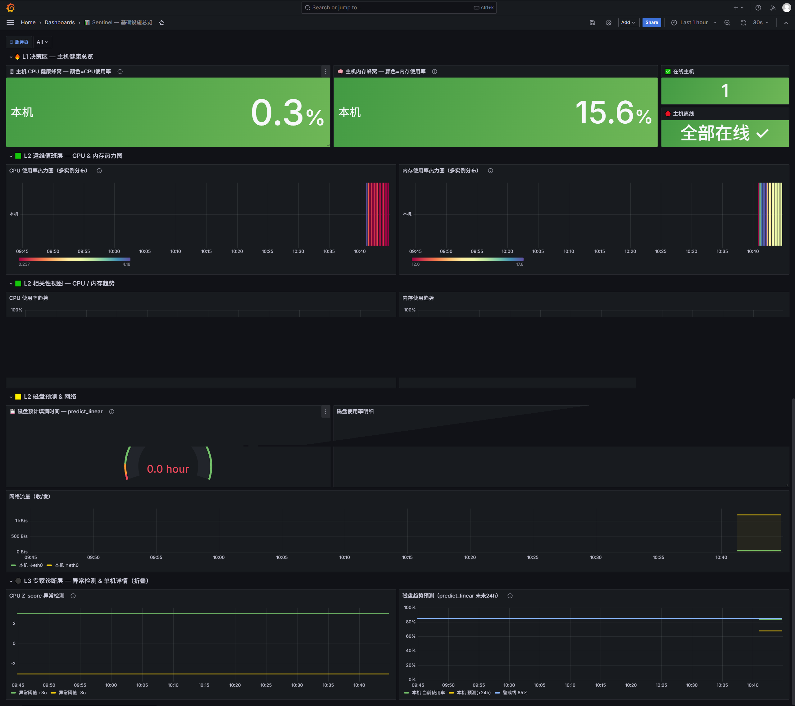
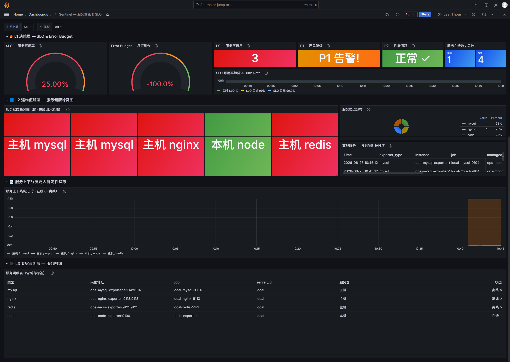
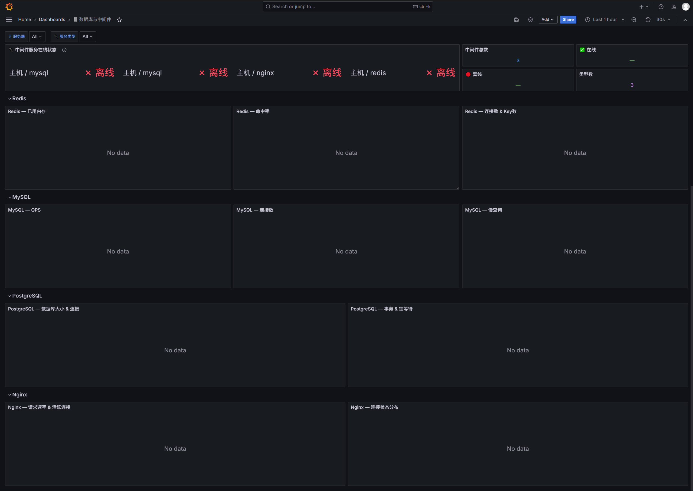

# OpsMonitor

[English](README.en.md)

OpsMonitor 是一个面向服务器与中间件的自动化监控平台。它把 Spring Boot 控制平面、Prometheus 指标采集、Grafana 可视化、AlertManager 告警、VictoriaMetrics 长期存储和 Sentinel 自动化处置链路组合在一起，目标是让小团队也能获得接近企业级的监控、诊断、Runbook 和 Incident 闭环能力。

## 项目定位

传统监控系统常见的困境是：指标、告警、主机清单、诊断脚本、处置记录分散在不同工具中，故障发生后仍要人工登录多台服务器、复制命令、追踪告警状态。OpsMonitor 试图把这些环节收束到一个平台内：

- 服务器与 Exporter 纳管：统一登记 Linux / Windows / 容器化监控目标。
- Prometheus 配置治理：自动维护 targets、告警规则和重载流程。
- 告警中心：接收 AlertManager webhook，管理告警确认、静默和生命周期。
- Sentinel 自动化：告警触发后自动诊断，生成 Incident，并按 Runbook 执行处置步骤。
- 运维控制台：提供总览、Exporter、告警、拓扑、通知、配置、租户、审计和用户管理页面。

## 技术栈、真实困境与量化结果

| 技术栈 | 解决的真实困境 | 量化结果 |
| --- | --- | --- |
| Spring Boot 3.2 / Java 17 | 将监控对象、权限、审计、配置中心和自动化流程统一到一个控制平面 | 20+ REST Controller，覆盖服务器、Exporter、告警、Sentinel、RBAC、租户、通知等核心域 |
| Prometheus / AlertManager / Grafana / VictoriaMetrics | 指标采集、告警路由、仪表盘和长期存储分散，缺少统一编排 | Compose 一键拉起 5 个监控组件；默认 15s scrape/evaluation；VictoriaMetrics 默认 365 天保留 |
| docker-java 3.3.6 | 本机容器化 Exporter 管理需要人工维护容器、端口和状态 | 支持 Exporter 注册、启动、停止、批量注册、健康检查和 Prometheus target 写入 |
| Vue 3 CDN / 原生静态资源 | 运维后台需要低构建成本、可直接随 JAR 发布 | 单体 Spring Boot 应用直接托管管理台；`docs/` 提供 7 张系统截图 |
| Sentinel 自动化引擎 / JSch 0.2.17 | 告警后仍依赖人工登录服务器诊断和执行脚本 | 14 个 Sentinel 核心类；Runbook 支持 LOG、HTTP、SCRIPT、SSH 4 类步骤 |
| RBAC / 审计 / 输入校验 | 运维平台写操作风险高，需要权限边界和操作追溯 | 内置 ADMIN / OPS / VIEWER 角色模型，审计日志按天落盘 |

## 架构概览



## 功能特性

- 系统总览：Agent、Exporter、活跃告警和审计评分统一展示。
- Exporter 管理：支持注册、批量注册、标签编辑、健康检查和全链路诊断。
- 告警中心：支持 FIRING、ACKNOWLEDGED、RESOLVED 生命周期管理。
- Sentinel 自动化：支持手动诊断、告警联动诊断、Incident 管理和 Runbook 执行。
- 服务拓扑：按 Global、Project、Service、Instance 四层查看服务关系。
- 通知渠道：支持告警触发与恢复通知的渠道配置。
- 配置中心：记录纳管配置版本和历史。
- 多租户与 RBAC：支持基础租户配额、角色和权限管理。
- 系统审计：围绕配置、状态、告警、纳管对象和平台健康做运维体检。

## 截图

截图来自 `docs/` 目录，展示当前控制台主要页面。















## 快速开始

### 环境要求

- JDK 17+
- Maven 3.8+
- Docker Engine
- Docker Compose v2

### 配置环境变量

复制示例文件并按需修改：

```powershell
Copy-Item .env.example .env
```

开发环境可以使用默认值。生产或公网环境必须设置强密码和随机密钥：

```powershell
$env:OPS_ADMIN_PASSWORD="ChangeMe_Admin_123!"
$env:OPS_GRAFANA_PASSWORD="ChangeMe_Grafana_123!"
$env:OPS_HMAC_SECRET="replace-with-at-least-32-random-characters"
$env:OPS_WEBHOOK_SECRET="replace-with-random-webhook-secret"
```

### 启动监控组件

请从 `app/` 目录启动。当前项目生效配置目录是 `app/docker/`。

```powershell
cd app
docker compose -f docker/docker-compose.yml up -d
```

### 启动 OpsMonitor

```powershell
mvn spring-boot:run
```

访问地址：

- OpsMonitor Admin: http://127.0.0.1:8080/admin
- Classic Console: http://127.0.0.1:8080/
- Prometheus: http://127.0.0.1:9090
- AlertManager: http://127.0.0.1:9093
- Grafana: http://127.0.0.1:3000
- VictoriaMetrics: http://127.0.0.1:8428

## 构建与验证

```powershell
cd app
mvn -q -DskipTests compile
```

## 目录结构

```text
ops-monitor/
  app/
    pom.xml
    docker/                      # 生效的 Prometheus / Grafana / AlertManager 配置
    src/main/java/com/opsmonitor # Spring Boot 后端源码
    src/main/resources/static    # Vue 3 CDN 管理台静态资源
    src/main/resources/templates # 经典页面模板
  docs/                          # 开源展示截图
  README.md
  README.en.md
```

## 需求与贡献

欢迎围绕企业监控、自动化诊断和运维闭环方向提交 Issue 或 Pull Request。适合优先贡献的方向包括：

- 新增 Exporter 模板，例如 PostgreSQL、MySQL、Redis、Nginx、Windows、JVM 或业务自定义指标。
- 补充告警规则、Recording Rules、Grafana Dashboard 和服务拓扑展示。
- 扩展 Sentinel 诊断规则、Incident 分类、Runbook 步骤类型和执行结果展示。
- 改进权限模型、审计日志、输入校验、部署安全和生产环境配置体验。
- 完善文档、安装脚本、示例配置、截图说明和问题排查指南。

提交需求时建议说明使用场景、目标环境、期望效果和可复现步骤；提交 PR 时请尽量保持改动聚焦，并附上构建或手工验证结果。

## 安全提示

- 默认密码只适合本地开发。生产环境必须设置 `OPS_ADMIN_PASSWORD`、`OPS_GRAFANA_PASSWORD` 和 `OPS_HMAC_SECRET`。
- 建议生产环境设置 `OPS_WEBHOOK_SECRET`，并同步到 AlertManager webhook 配置。
- SSH Runbook 在生产环境建议启用严格主机密钥校验，并配置 `OPS_SSH_KNOWN_HOSTS`。
- 不要提交 `data/`、`app/data/`、`.env`、锁文件、健康报告和审计日志。

## 许可证

本仓库尚未内置许可证文件。正式公开前请确认许可证类型，企业基础设施类项目通常可选择 Apache-2.0 或 MIT。
